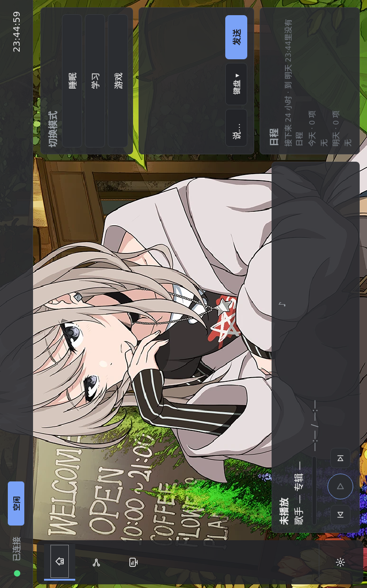
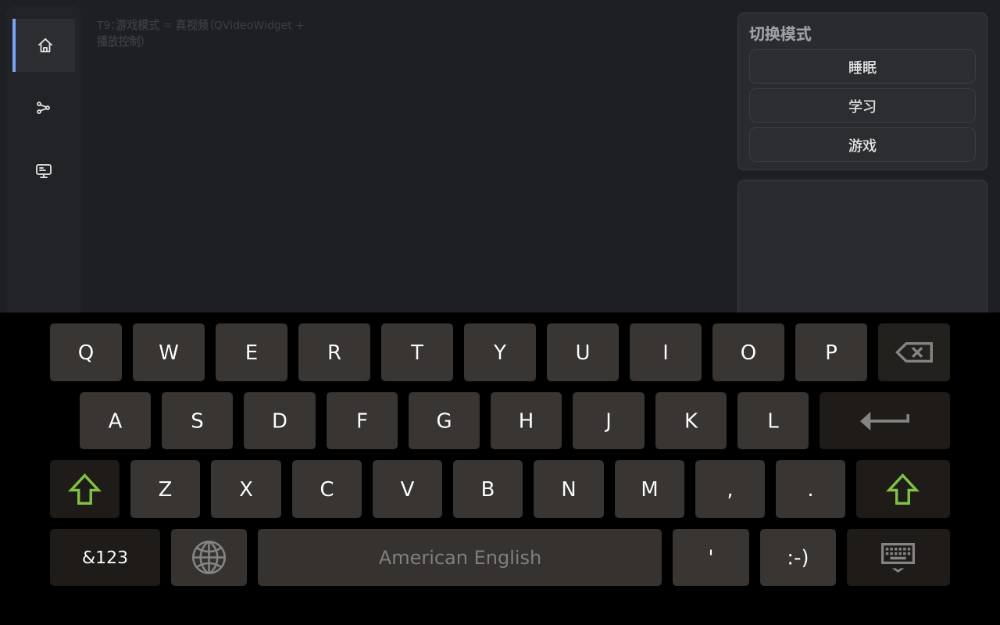
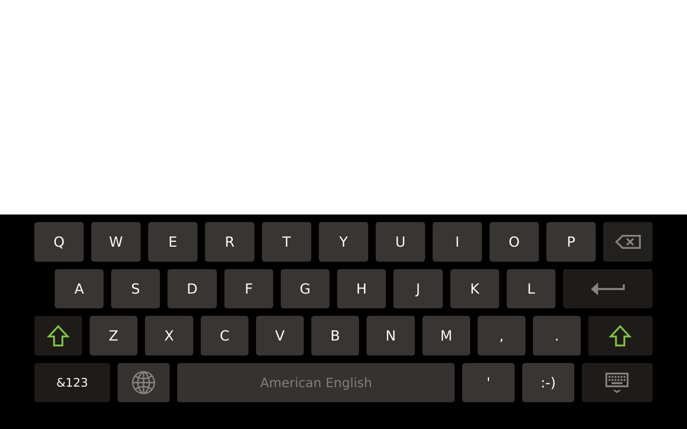
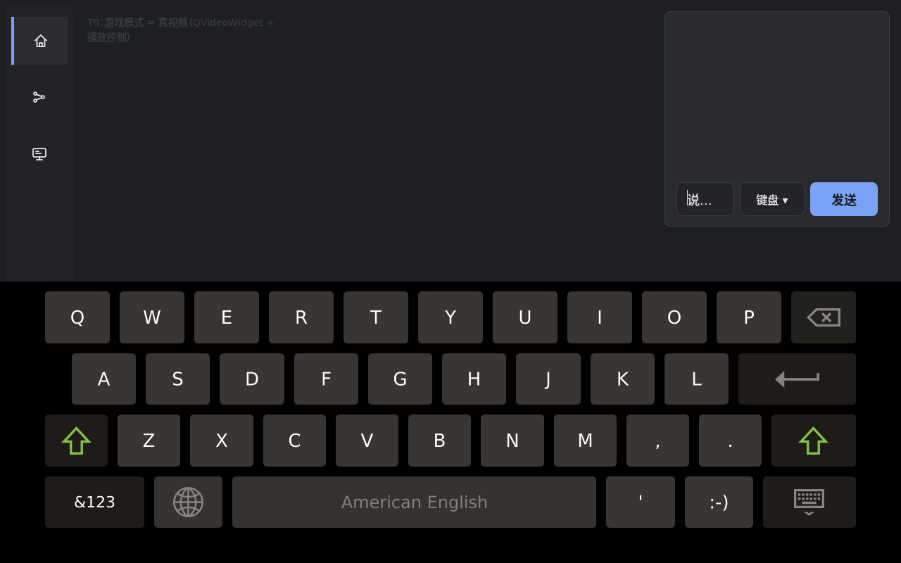
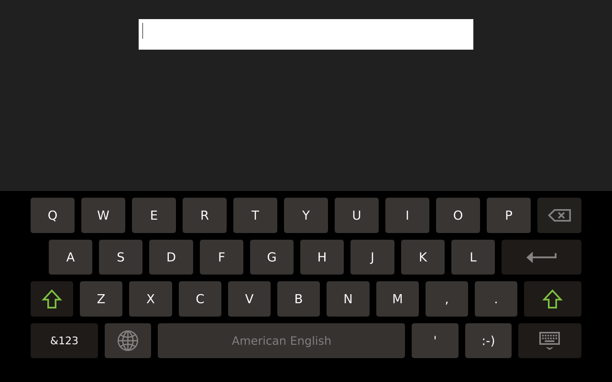

# RK3568 桌面助手

面向 RK3568 / KICKPI K1 Mini 的板端助手：Python Agent 负责状态、对话与工具编排，
C++ / pybind11 负责 Sunshine 串流接收、视频解码和键鼠发送，Qt5 C++ GUI 在板端显示与交互。
源码、构建与部署由开发机维护，Agent 和 GUI 通过同机 Unix domain socket 通信。

## 功能演示与实测数据

以下都是**在真板子上跑出来的**（KICKPI K1 Mini / Buildroot 镜像 / 1280×800 DSI 屏）✓，
不是设计目标 ✓。

### 零拷贝视频（B 站）

```
[video] 走零拷贝主路径（dmabuf ⇒ Qt EGL）
[gstvideo] caps 尺寸 = 640 x 360
[gstvideo] 绘制帧率 fps= "25.0"（每 120 次绘制 4801 ms）零拷贝帧= 240  平均画帧间隔(ms)= "40.0"  最大= 52
vqueue 进程数 = 0     page flip 错误 = 0     agent-gui NRestarts = 0
CPU 占用：整机 14.7~16.8%（未走零拷贝时 112.7%）
```

链路：`B 站直链 → ffmpeg 合流为 MPEG-TS → 板端回环 HTTP 内存缓冲 → GStreamer(tsdemux → mppvideodec) →
dmabuf → Qt EGL` ✓，视频内容不落盘 ✓。刷流时 GUI 的绘制节拍稳定在 40 ms（25 fps）✓。

### 对话 / 工具调用 / 入队（真 terminal 输出）

```console
$ assistant chat --timeout 240 "搜索 罗刹海市"
助手: 罗刹海市已成功搜索到，当前第0条，内容为【Hi-Res无损音质】刀郎《罗刹海市》无损音质经典歌曲完整版。

# agent 侧（同一时刻的日志）
agent: [terminal] 搜索 罗刹海市
agent: bilibili: 搜「罗刹海市」-> 成功（18 条, 目标 18）
agent: 回复: 罗刹海市已搜索并排至预览队列。当前为第 0 条…

$ assistant video next
现在是：【Hi-Res无损音质】刀郎《罗刹海市》无损音质经典歌曲完整版
下一集：罗刹海市 - 刀郎【Hi-Res无损音质】（正在缓冲 —— 攒够 15 秒才让播放器开）
```

### 游戏串流（Moonlight ↔ Sunshine）

```
22:57:46 WARNING native: 第 1 次连接失败（… [Errno 101] Network is unreachable），5 s 后重试（总窗口 600 s）
22:57:51 INFO    sunshine: Anorak_Host appversion=7.1.431.-1 PairStatus=1
22:57:51 INFO    sunshine: app=Desktop -> appid=881448767 (走 /resume) sessionUrl=rtspenc://192.168.137.1:48010
22:57:51 INFO    native: 第 2 次尝试连上了 ✓
（板端线程：VideoRecv / VideoDec / mpp_dec_parser / mpp_dec_hal / ReqIdrFrame）
（PC 侧 Sunshine 日志：CLIENT CONNECTED + Creating encoder [hevc_nvenc] + Opus initialized）
```

冷启动时 agent 比网络早 ⇒ 现在会**退避重试**，WiFi 一上来（~11 s）自己就连上 ✓。

### 截图

**板端主界面**（800×1280 实机整屏 ✓）：左上时间、顶部「睡眠 / 学习 / 游戏」模式切换、
聊天输入（`说…` + 键盘/发送）、右上日程面板、中间壁纸、左下 **「空闲」+ 绿点「已连接」**、
底部音乐条与导航栏（主页 / 音乐 / 图片 / 设置）✓



抓图方法（可复现 ✓）：板端 GStreamer 的 `kmssrc`（`gst-rockchip` 提供 ✓）——
`gst-launch-1.0 -q kmssrc num-buffers=2 ! videoconvert ! filesink location=shot.raw`
⇒ 800×1280×4 裸帧，回 PC 用 PIL 转 PNG ✓。
⚠ 试过但**走不通**的两条：① `/dev/fb0`（GUI 走 DRM/EGLFS，抓到整帧**全黑** ✗）；
② `pngenc` / `jpegenc`（这套精简镜像里**没有**这两个编码器 ✗）⇒ 所以走裸帧 + PC 编码 ✓。

Qt 虚拟键盘（`docs/images/`）：

| 覆盖层形态 | 白底输入态 | 透明输入态 | 最小化 |
| --- | --- | --- | --- |
|  |  |  |  |

> ⚠ 上面那张主界面截图里的壁纸来自本机壁纸库（内容由使用者自行放置 ✓，不含在仓库里 ✓）；
> 若要公开仓库，可换成中性壁纸再抓一张 ✓（抓图命令同上 ✓）。

## 当前运行形态

| 形态 | 系统与构建 | 代码与状态位置 |
| --- | --- | --- |
| 系统镜像 | 厂商 Linux 6.1 SDK + Buildroot；GUI 使用 SDK 的 Qt 5.15.11 交叉编译，EGLFS 无 X 运行 | 代码 `/usr/lib/assistant`；配置、日志、运行状态 `/data/assistant`；模型 `/data/model` |
| 开发 checkout | 原 Ubuntu 20.04 / aarch64 / Python 3.8 / glibc 2.31 环境；native 可由 Windows 交叉编译，GUI 可在有 Qt 开发依赖的板端编译 | checkout 约定 `/home/kickpi/myproject/assitant`；可用环境变量覆盖配置与运行状态路径 |

两种形态的工具链、Python ABI 和 Qt 库不同，产物必须按目标系统重新编译。
镜像的构建、刷写和 A/B 升级见 [系统镜像说明](docs/image.md) 与 [刷板手册](image/FLASH-RUNBOOK.md)。

## 已实现功能

| 功能 | 当前实现与边界 |
| --- | --- |
| 对话 | `edge` 访问本机 llama-server，`cloud` 访问 OpenAI 兼容 API，`disabled` 使用规则兜底；模型错误会降级并记录原因 |
| 模式与日程 | `SLEEP` / `IDLE` / `STUDY` / `GAME`，模式切换经过 IDLE；日程支持周期和一次性事件，执行状态切换 |
| 壁纸 | 本地壁纸目录、SigLIP 三轴标签、IP 检索、画像选图与 prev/current/next 三格窗口；通过对话工具换图 |
| 音乐 | 板端经 SSH 调 PC 的 neteasecli，声音在 PC 播放；本地库、队列补歌、播放控制、歌词与画像偏好 |
| B 站视频 | 搜索队列与预览；GUI 操作起播；ffmpeg 合流为 MPEG-TS，经板端回环 HTTP 内存缓冲交给 GStreamer；视频内容不落盘 |
| 游戏检测 | SigLIP 画面锚点与 PC 进程双路判断，不一致时由进程裁决并自学习纠错 |
| 学习监督 | 内容锚点、相对分判定、提醒升级与返回桌面、阈值自适应及有界统计；不确定结果保留为 unknown |
| GUI 与管理 | 聊天、模式、日程、音乐、视频、模型、设置、系统状态；Qt 虚拟键盘；CLI、Wi-Fi 管理、崩溃日志与 OTA 状态/确认 |

GGUF 模型由独立的 llama-server 进程加载，**不在 Python Agent 内推理**。
SigLIP 双塔模型通过 RKNNLite 在 NPU 推理；CPU 上仍有预处理、分词和结果处理。
模型、厂商 SDK、板端凭据及用户媒体不随源码仓库分发。

CPU 调度与 NPU/CPU 协同、内存优化、低功耗的后续工作见 [todo3.md](todo3.md)。
现有 `SLEEP` 状态和资源释放逻辑不等同于完整的系统低功耗实现。

## 架构与数据通路

```text
Windows PC：Sunshine / neteasecli / 进程探测
    │ 视频下行、命令上行           ▲ SSH 调用
    ▼                            │
RK3568 native：moonlight-common-c → MPP 解码 → ROI / RGB 预处理
    │ 256×256 RGB888，300 帧 SPSC 环形缓冲
    ▼
Python Agent：asyncio → 视觉 / 状态机 / 日程 / LLM / 工具 / 画像
    │ 同机 Unix domain socket（默认 /tmp/agent.sock）
    ▼
Qt5 GUI：页面 / 控制 / Qt 虚拟键盘 / GStreamer 视频显示
```

- native 解码器支持 H.264 / H.265。`auto` 先尝试 Rockchip MPP，再尝试编入的 FFmpeg 软解后端；指定后端时不自动回退。
- `ImageReader` 与 `InputSender` 把 native 调用放在各自专属的单线程执行器中；环形缓冲读取必须保持单消费者线程。
- GUI 的视频播放与 native 的视觉取帧是两条通路。GUI 的 DMA-BUF 导入与 EGL 渲染见 [零拷贝记录](docs/dmabuf-zero-copy-findings.md)。
- GUI 向 Agent 提交设置与凭据命令；Agent 负责生产写入。`config/config.yaml` 是配置真源，`llm/config/llm.env` 由其派生。
- 纯对话记忆有界且不落盘；画像、音乐库、壁纸标签、学习/游戏锚点是板端本地数据。

详细拓扑和接口见 [架构文档](docs/architecture.md)、[IPC 协议](docs/ipc-protocol.md) 与 [架构决策](docs/adr/README.md)。

## 源码目录

```text
native/       C++ 解码、预处理、环形缓冲、Moonlight 适配、pybind11 绑定
agent/        Python 入口与 CLI；core / io / ipc / llm / media / net / tools / vision
gui/          Qt5 C++ 界面、服务层、资源、QTest 与联调工具
config/       config.example.yaml、user_profile.example.yaml 公共模板
llm/scripts/  llama-server 启停与状态检查
image/        SDK 注入、Buildroot 配方、镜像构建、验收、payload、OTA 执行器
systemd/      checkout 与镜像各自的服务单元
cmake/        原 Ubuntu 开发环境的交叉工具链
scripts/      构建、部署、测试、监控、配对与代码审计
tests/        Python / C++ 宿主测试、测试夹具与 board 真机验收脚本
docs/         功能、部署、协议、架构、镜像与性能文档
todo3.md      三项后续优化任务
```

`todo.md`、`todo2.md` 为本地历史工作记录，已取消 Git 跟踪；公开文档不依赖它们。

## 配置与首次运行

先初始化子模块：

```bash
git submodule update --init --recursive
```

Python 基础依赖是 PyYAML；视觉取帧/预处理需要 NumPy 和具备所需图像 API 的 OpenCV。
`edge` / `cloud` 客户端还需要 openai，SigLIP 需要 tokenizers、匹配板端驱动的 RKNNLite、RKNN 模型和分词器。
宿主测试可注入替身，不能代替板端硬件验证。镜像依赖由 `image/` 配方准备。

checkout 环境在仓库根初始化配置：

```bash
cp config/config.example.yaml config/config.yaml
cp config/user_profile.example.yaml config/user_profile.yaml

python3 agent/main.py --check-config
python3 agent/main.py --dry-run
python3 agent/main.py
```

模板默认 `llm.mode=disabled`，音乐默认关闭。按需要填写 Sunshine 主机、配对证书路径、
PC 的 SSH 用户和模型路径，再打开对应功能；模板中的示例地址与用户名必须替换。
模板中的本地 LLM key 是占位符，启用 edge 前在真实配置中设置独立随机值，并确认派生的 llm.env 与客户端一致。
llm.env 的初始化和服务管理要求见 [LLM 文档](docs/llm.md) 与 [运行时说明](llm/README.md)。

镜像首次启动的配置初始化见 [payload 配方](image/payload.manifest)。运行服务与 CLI：

```bash
systemctl status agent.service agent-gui.service
assistant status
assistant chat "现在是什么状态"
assistant mode study
assistant schedule --hours 12
assistant doctor
```

`assistant` 是 CLI 命令名；从源码直接使用时入口是 `python3 -m agent.cli`。
在镜像交互式 shell 中，`image/payload/assistant.sh` 设置代码、配置、日志和 LLM 状态路径；
checkout 环境可通过 `AGENT_CONFIG_DIR`、`AGENT_LOG`、`LLM_ENV_FILE`、`LLM_STATE_DIR` 覆盖相应位置。
命令细节见 [CLI 手册](docs/cli.md)。

## 工具与状态权限

工具清单和执行都按当前状态过滤，依次检查工具存在、状态权限、参数 schema、执行超时与异常。
同步 handler 放入线程池；超时不会强制终止已经开始的 Python 线程。

| 状态 | `back_to_desktop` | `next_wallpaper` | `next_music` | `bilibili_search` | `set_schedule` |
| --- | --- | --- | --- | --- | --- |
| SLEEP | ✗ | ✗ | ✗ | ✗ | ✗ |
| IDLE | ✗ | ✓ | ✓ | ✗ | ✓ |
| STUDY | ✓ | ✓ | ✓ | ✗ | ✓ |
| GAME | ✗ | ✗ | ✗ | ✓ | ✗ |

权限的代码验证在 `tests/test_tool_permissions.py`。
GUI 音乐/视频播放控制是 IPC 命令，不属于 LLM 工具权限表；B 站搜索工具只填队列，不自动播放。

## 构建、测试与部署

Windows 开发环境的 native 构建与测试：

```powershell
scripts/build.ps1
scripts/test-host.ps1
scripts/test-python.ps1
```

`build.ps1` / `cmake/toolchain.cmake` 使用本地 `E:/rk3568/arm` 和 `E:/rk3568/sysroot`，
对应原 Ubuntu/Python 3.8 环境。换路径需调整脚本与工具链；它不是 Buildroot 镜像的编译入口。
checkout 部署使用 `scripts/deploy.ps1`，GUI 同步使用 `scripts/sync-gui.ps1`，参数见 [部署说明](docs/deploy.md)。

有完整 Qt5 开发依赖的 Linux 宿主或板端可独立构建 GUI：

```bash
cmake -S gui -B build-gui-host -DGUI_BUILD_TESTS=ON
cmake --build build-gui-host --parallel 4
QT_QPA_PLATFORM=offscreen ctest --test-dir build-gui-host --output-on-failure
```

GUI 需要 Qt5 Core / Network / Widgets / Multimedia / MultimediaWidgets / QuickWidgets、
yaml-cpp，运行软键盘需要匹配的 Qt Virtual Keyboard/QML 模块。离屏测试不验证 EGLFS、触摸或 MPP 视频显示。

Buildroot 镜像在 Linux / WSL 中使用厂商 SDK：

```bash
bash image/install-into-sdk.sh <SDK>
bash image/build-image.sh <SDK>
bash image/preflash-check.sh <SDK>
```

GUI、native、llama-server 的镜像构建入口分别为 `image/build-gui.sh`、`image/build-native.sh`、
`image/build-llama.sh`，由 payload 构建串联；刷板前验收中需要 chroot 的步骤以 root 执行。
SDK 布局、镜像 flavor、模型与 userdata 的处理见 [镜像配方入口](image/README.md)。

宿主 CI 验证 native 宿主分支、Python 测试及代码审计；目标交叉编译、GUI 与真机验证的边界见 [CI 说明](docs/ci.md)。
性能数字见 [基准说明](docs/bench.md) 和 [CPU / 内存历史测量](docs/perf-cpu-mem.md)，它们是特定环境的记录。

## 文档索引

| 内容 | 文档 |
| --- | --- |
| 配置来源与分级 | [配置来源](docs/config-sources.md) |
| LLM 与工具循环 | [LLM](docs/llm.md) |
| 壁纸、音乐、画像 | [标签与检索](docs/tagging.md)、[音乐](docs/music.md)、[画像](docs/profile.md) |
| 视频与学习监督 | [B 站](docs/bilibili.md)、[学习监督](docs/study.md) |
| GUI 与 IPC 联调 | [GUI](docs/gui.md)、[GUI 风格](docs/gui-style.md)、[Agent 联调](docs/gui-agent-integration.md) |
| 解码与网络 | [MPP](docs/decoder-mpp.md)、[网络](docs/net.md) |
| OTA 与崩溃排查 | [OTA](docs/ota.md)、[崩溃日志](docs/crash.md) |
| 优化任务与公开检查 | [todo3](todo3.md)、[公开前审计](docs/publication-audit.md) |
